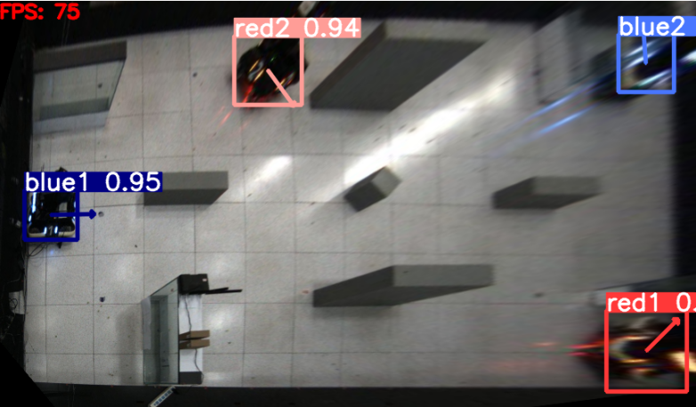

# <div align="center"> Yolov5 旋转目标检测 </div>

<details open>
<summary>简介</summary>
本项目基于 [Yolov5](https://github.com/ultralytics/yolov5/tree/v7.0) 开源项目，实现了全向旋转目标检测。本项目是基于回归的方式对目标朝向信息进行分类，通过计算L1损失并和其他几个损失加权求和得到总的损失。
</details>

<details open>
<summary>训练数据格式</summary>
和Yolov5格式基本一致，但txt文件中的每个目标最后添加一个角度信息（需要归一化到0~1），具体格式为：
```bash
label x y w h theta
```
</details>

<details open>
<summary>训练参数设置</summary>
基本和Yolov5训练数据的指定方式一致
</details>

<details open>
<summary>训练效果展示</summary>
图中箭头方向即为模型推理的目标朝向

</details>

<details open>
<summary>旋转目标标注工具推荐</summary>
- [roLabelImg] (https://github.com/wzw1105/roLabelImg)
</details>

<details open>
<summary>Reference</summary>
- [https://github.com/ultralytics/yolov5/tree/v7.0] (https://github.com/ultralytics/yolov5/tree/v7.0)
</details>